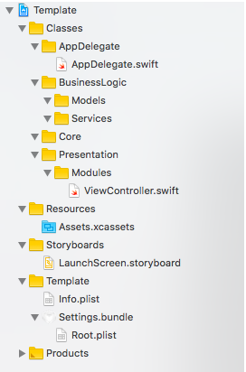

# swift-project-template
Cookiecutter template for an Swift iOS project.

## Usage
1. Install [Cookiecutter](https://github.com/audreyr/cookiecutter) and [Carthage](https://github.com/Carthage/Carthage):
   
   `brew install cookiecutter carthage`
   
   We use Carthage as dependency manager by default.
    
2. Run `cookiecutter gh:artemnovichkov/swift-project-template`. No need to create project folder manually, cookiecutter does it for you.

For future runs you can shorten the command to `cookiecutter swift-project-template`. However, if you want to use the most recent template you should still run the full command above.

## Features:
* Xcode 9.1 and Swift 4.0.2 support
* AppCode support (checked in 2017.2 version)
* Custom project structure (the same in the project and on the disk)
* Debug, AdHoc, AppStore and Analyze configurations
* Custom scripts for [Carthage](https://github.com/Carthage/Carthage) and [SwiftLint](https://github.com/realm/SwiftLint)
* iOS Deployment Target - 9.0
* Template for Github pull requests
* `Settings.bundle` with app version
* Disabled automatic code signing (sorry, Apple 🤷‍♂️)
* `-Xfrontend -debug-time-function-bodies` flags for [profiling compilation times](https://github.com/RobertGummesson/BuildTimeAnalyzer-for-Xcode)
* `.gitattributes` for correct repo language detection via [linguist](https://github.com/github/linguist)

## Author

Artem Novichkov, novichkoff93@gmail.com

## License

swift-project-template is available under the MIT license. See the LICENSE file for more info.
