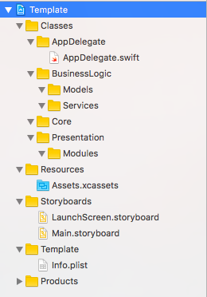

# swift-project-template
Cookiecutter template for an Swift iOS project.

## Usage
1. Install [cookiecutter](https://github.com/audreyr/cookiecutter) (`brew install cookiecutter` on macOS).
2. Run `cookiecutter gh:artemnovichkov/swift-project-template`.

For future runs you can shorten the command to `cookiecutter swift-project-template`. However, if you want to use the most recent template you should still run the full command above.

## Features:
* Xcode 8.0+
* Swift 3.0+
* Custom project structure (the same in the project and on the disk)
* Custom scripts for [Carthage](https://github.com/Carthage/Carthage) and [SwiftLint](https://github.com/realm/SwiftLint)
* iOS Deployment Target - 9.0 (two major versions)
* Automatic code signing disabled (sorry, Apple 🤷‍♂️)

## Issues:
* Wrong `AppDelegate` creation date (who cares?..)

## Author

Artem Novichkov, novichkoff93@gmail.com

## License

swift-project-template is available under the MIT license. See the LICENSE file for more info.
