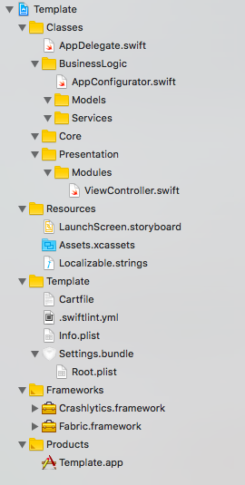
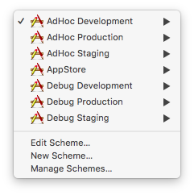

# swift-project-template

🍪 Cookiecutter template for Swift iOS projects.

## Features:
* Xcode 9.3+ and Swift 4.1+ support
* AppCode support (checked in 2017.2 version)
* Custom project structure (the same in the project and on the disk)
* Configurations and schemes:

* Custom scripts for [Carthage](https://github.com/Carthage/Carthage) and [SwiftLint](https://github.com/realm/SwiftLint)
* iOS Deployment Target - 9.0
* Optional [Fabric](https://www.fabric.io) integration. Don't forget to add API Key and Build Secret manually from [Settings](https://www.fabric.io/settings/organizations)
* Optional [SwiftGen](https://github.com/SwiftGen/SwiftGen) integration
* Template for Github pull requests
* `Settings.bundle` with app version
* Disabled automatic code signing (sorry, Apple 🤷‍♂️)
* `-Xfrontend -debug-time-function-bodies` flags for [profiling compilation times](https://github.com/RobertGummesson/BuildTimeAnalyzer-for-Xcode)
* `.gitattributes` for correct repo language detection via [linguist](https://github.com/github/linguist)

## Usage
1. Install [Cookiecutter](https://github.com/audreyr/cookiecutter) and [Carthage](https://github.com/Carthage/Carthage):
   
   `brew install cookiecutter carthage`
   
   Carthage is used as dependency manager by default.
    
2. Run `cookiecutter gh:artemnovichkov/swift-project-template`. No need to create project folder manually, cookiecutter does it for you.

For future runs you can shorten the command to `cookiecutter swift-project-template`. However, if you want to use the most recent template you should still run the full command above.

## Author

Artem Novichkov, novichkoff93@gmail.com

## License

swift-project-template is available under the MIT license. See the LICENSE file for more info.
